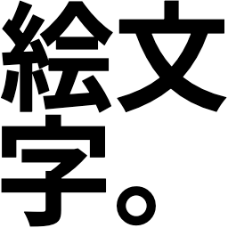

# libemoji
[](https://github.com/emoji-gen/libemoji/actions/workflows/test.yml)
[](https://opensource.org/licenses/MIT)

:tada: Ultimate Emoji Generator library using [Skia](https://skia.org/)

<br>
<br>

## System requirements

- CMake
- Python 3
- C11 Compiler
- C++20 Compiler

### Officially supported platforms
We officially support building and running on these platforms below, but you can try it on other platforms.

- macOS 26 Tahoe (arm64)
- Ubuntu 24.04 (x86\_64)

### macOS
When you build this on macOS, please run the commands below before building.

```
$ brew install cmake
```

### Ubuntu 24.04
When you build this, please run the commands below before building.
And, they probably work as well on other Debian versions.

```
$ sudo apt-get update
$ sudo apt-get install git cmake g++ python3 libfontconfig1-dev \
    libx11-dev libxcomposite-dev libgl1-mesa-dev libglu1-mesa-dev freeglut3-dev -y
```

## How to build

```
$ git submodule update --init
$ cmake .
$ make
```

## Example

```c
#include <stdio.h>
#include <string.h>

#include "emoji.h"

int main(void) {
    EgGenerateParams params;
    memset(&params, 0, sizeof(params));
    params.fText = "絵文\n字。";
    params.fWidth = 256;
    params.fHeight = 256;
    params.fColor = 0xFF000000; // ARGB
    params.fBackgroundColor = 0xFFFFFFFF; // ARGB

    EgGenerateResult result;
    if (emoji_generate(&params, &result) != EG_OK) {
        emoji_free(&result);
        return -1;
    }

    FILE *fp = fopen("./emoji.png", "w");
    fwrite(result.fData, result.fSize, 1, fp);
    fclose(fp);

    emoji_free(&result);
    return 0;
}
```

See also `example` directory.

## Development
### Run formatter

```
$ clang-format --version
clang-format version 21.1.8

$ clang-format -i -style=file src/*.cpp src/*.h
```

## See also

- [Google 開発の 2D グラフィックライブラリ Skia の紹介とはじめかた](https://emoji-gen.ninja/blog/posts/20190204/skia.html) (Japanese)

## License
MIT &copy; [Emoji Generator](https://emoji-gen.ninja)
